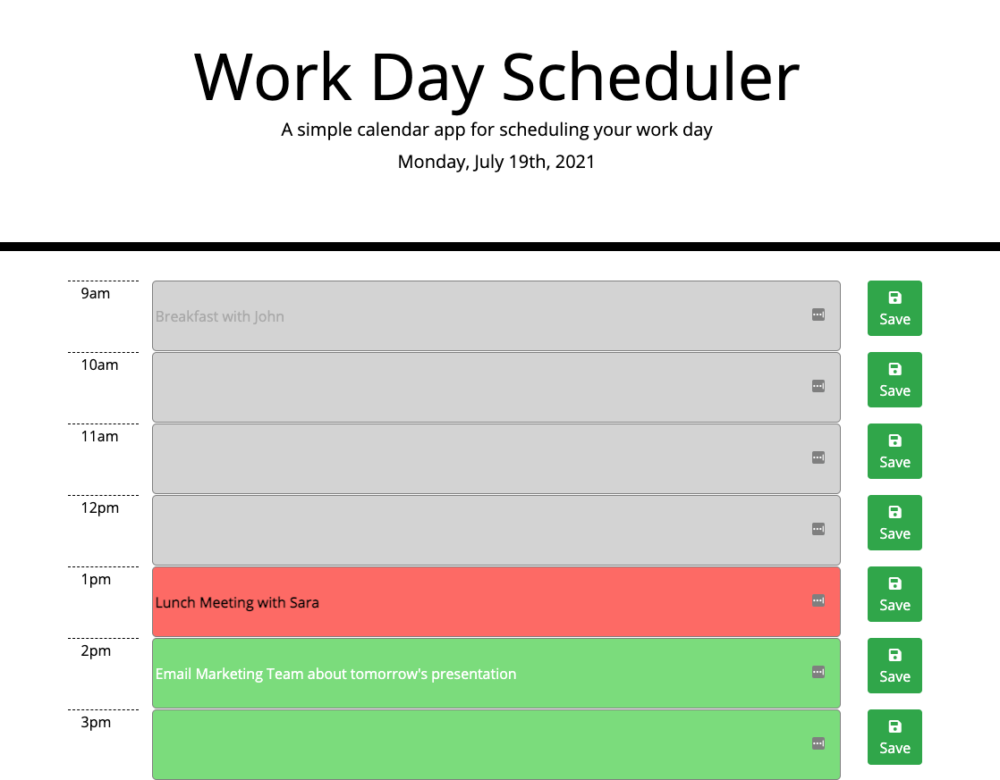

# Creating a Day Planner in JavaScript

I started this project by breaking it down into major components:

1. Display the current day at the top of the application
2. Create the rows and columns of the scheduler
3. Update the colors of the rows based on the current time
4. Set the localStorage to store the events and ensure they stay after a page refresh

The first major components was a simple line of code that involved using the moment() method and quickly loaded on the page.

The second major component took a couple trial and errors. My first thought was to create all the rows and columns in the .html file and then link them in the .js file; however, I have done that in previous projects and wanted to challenge myself to create all the HTML elements dynamically through Javascript. The turning point in creating the elements was to set them in terms of the hours of the planner (which i set to [i]) and used througout the .js file. The idea of a scheduler is based on the time of day -- so I used my code to reflect that. I created a 'for loop' that made all of the elements needed to create the scheduler.

Inside of the elements were important ids - such as `inputText{i}. The ids were very effective in calling the HTML elements for various parts of the code for the third and fourth major components.

The third component of the project was changing the row color based on the current time of day which utilized another 'for loop.' Selected the specific HTML element via 'id' made creating this function very streamline.

The fourth component of setting the localStorage was the trickiest part of the project because I wanted to save the user input for each individual 'time-slot' and when the page refreshed -- the same data was in the same spot. This is where the use of the 'id' came in handy again. I created a click event function for each 'Save' button and linked the data-id (in this case, it was the hour of the day), and navigated through the HTML elements from the clicked button to corresponding input from the user. I saved those two data points together in the localStorage. Then using a 'for loop,' I called them back out from localStorage in the appropriate time slot.

Click [here](https://evanarbour.github.io/day-planner/) for the Work Day Scheduler application.
